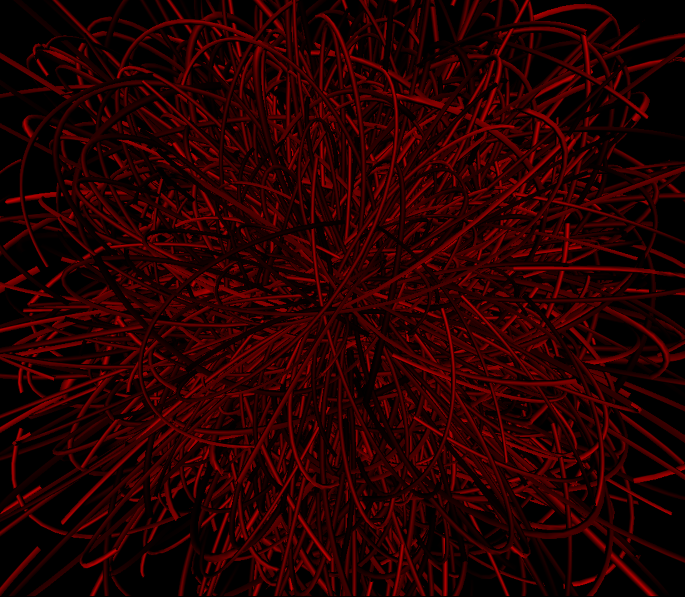

# WebGPU Metal Noodles

A whole bunch of metal noodles.




## How to run

```
npm install
npm run dev
```

## How it works

There are two main parts to this project:

A compute shader which solves the equation of motions of the primary particles and lets the secondary particles trace the path of the primary particles.

A render pipeline, where the vertex shader is used to generate the noodle geometry, where each particle corresponds to a joint of the noodle.